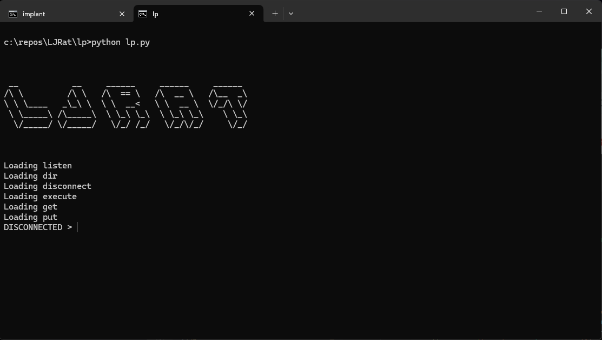

# LJRat
LJRat is a modular Windows Remote Access Tool (RAT) capable of remotely controlling a Windows Computer. Ideal for learning Red Team techniques in a home lab environment.

Please check out the [Getting Started](https://github.com/A-miNo/LJRat/wiki/Getting-Started) guide.

## v1.0
- Get
- Put
- Execute
- Dir
- Disconnect

## Building
The following packages are required to build the RAT Client
- Cmake (https://cmake.org/download/)
- MSVC Build Tools (https://aka.ms/vs/17/release/vs_BuildTools.exe)
- Python 3.10 (https://www.python.org/downloads/)
- Run build.bat afer installing the requisite components to generate the client
